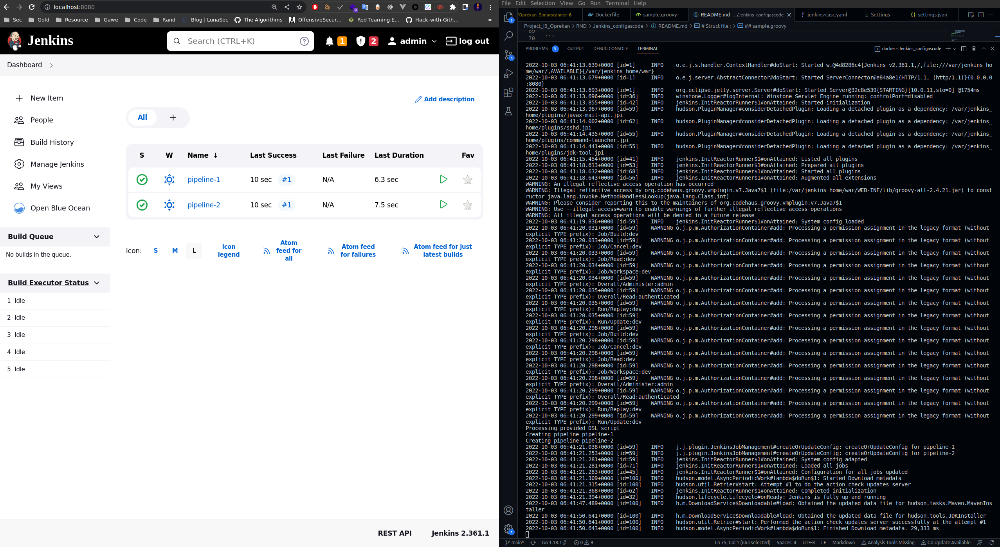

# Jenkins Configuration as Code

Example jenkins-casc simple 

# Prerequest
- docker
- internet connection

# Struct file :

```
.
├── Dockerfile
├── jenkins-casc.yaml
├── README.md
└── sample.groovy
```

## Dockerfile 

```bash
FROM jenkins/jenkins:lts-jdk11

RUN jenkins-plugin-cli \
    --plugins \
    configuration-as-code \
    matrix-auth \
    git \
    workflow-aggregator \
    blueocean \
    workflow-job \
    workflow-cps \
    job-dsl \
    pipeline-utility-steps

ENV JAVA_OPTS -Djenkins.install.runSetupWizard=false
COPY sample.groovy /usr/local/sample.groovy
COPY jenkins-casc.yaml /usr/local/jenkins-casc.yaml
ENV CASC_JENKINS_CONFIG /usr/local/jenkins-casc.yaml
```

## jenkins-casc.yml

```yaml
jenkins:
  securityRealm:
    local:
      allowsSignup: false
      users:
        - id: "admin"
          password: "devopskeren123!@#"
        - id: "dev"
          password: "dev"
  authorizationStrategy:
    globalMatrix:
      permissions:
        - "Job/Build:dev"
        - "Job/Cancel:dev"
        - "Job/Read:dev"
        - "Job/Workspace:dev"
        - "Overall/Administer:admin"
        - "Overall/Read:authenticated"
        - "Run/Replay:dev"
        - "Run/Update:dev"
  numExecutors: 5

jobs:
  - file: /usr/local/sample.groovy

```

## sample.groovy

```groovy
pipelines = ["pipeline-1", "pipeline-2"]

pipelines.each { pipeline ->
    println "Creating pipeline ${pipeline}"
    create_pipeline(pipeline)
}

def create_pipeline(String name) {
    pipelineJob(name) {
        definition {
            cps {
                sandbox(true)
                script("""
pipeline {
    agent any
    stages {
        stage("Test1") {
            steps {
                sh "echo 'helo from ${name}'"
                sh "whoami"
                sh "ls -lah"
            }
        }
        stage("Test2") {
            steps {
                sh "echo testing 1"
            }
        }
    }
}

""")
            }
        }
    }
}
```

# Step to run

## build image
```bash
docker build -t test-jcasc:v1 .
```

## run jenkins
```bash
docker run --rm --name jenkins-casc -p 8080:8080 test-jcasc:v1
```
## example



# Ref
- https://github.com/jenkinsci/configuration-as-code-plugin/tree/master/demos
- https://verifa.io/blog/getting-started-with-jenkins-config-as-code/index.html